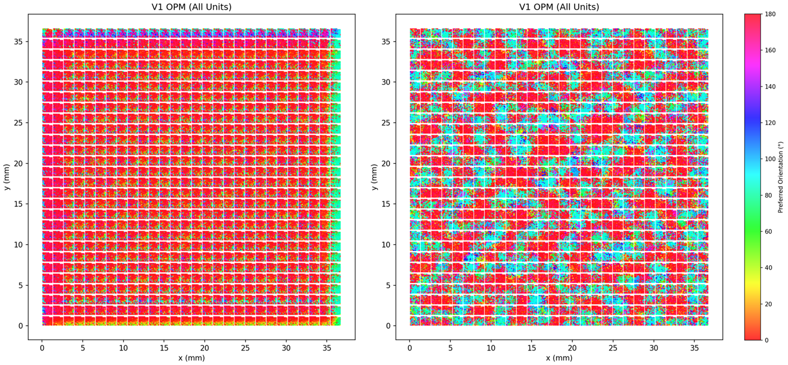
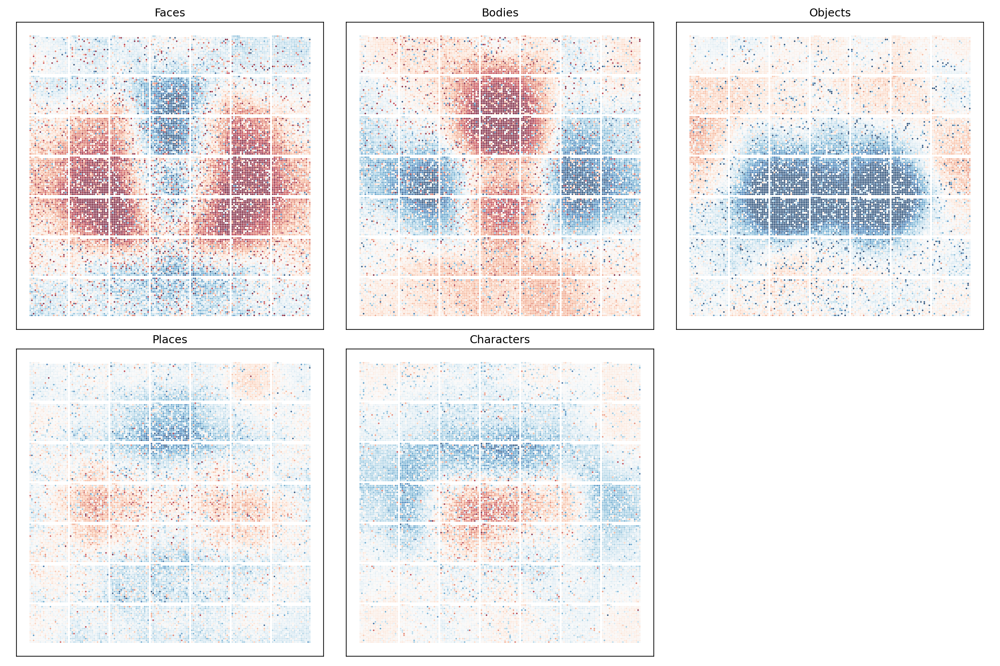

# TDANN: Topographic Deep Artificial Neural Network

A PyTorch reproduction of **"A unifying framework for functional organization in early and higher ventral visual cortex"** (Margalit et al., Neuron 2024).

📄 **Original Paper**: [https://doi.org/10.1016/j.neuron.2024.04.018](https://doi.org/10.1016/j.neuron.2024.04.018)

> **Note**: This is an **independent reproduction** based solely on the paper and its supplementary materials. No original code was referenced during implementation. For the official implementation, please refer to the links provided in the original publication.

## Overview

The TDANN is a model that predicts both functional responses and spatial organization of multiple cortical areas in the primate visual system. It combines:

1. **Task Objective**: SimCLR self-supervised learning for task-general representations
2. **Spatial Objective**: Encourages nearby units to have correlated responses

$$
TDANN_{Loss} = L_{task} + \alpha \times \sum SL_k \quad (\alpha_{opt} = 0.25)
$$

## Results

### V1 Orientation Preference Maps



*Left: 5 epochs. Right: 200 epochs. After 200 epochs of training, the V1-like layer (L4) develops richer orientation preferences with more diverse colors across the map, indicating improved spatial organization.*

### VTC Category Selectivity Maps (5 epochs)



*Category selectivity (t-statistic) for faces, bodies, objects, places, and characters in the VTC-like layer (L9). Red indicates positive selectivity, blue indicates negative selectivity.*

**Observation**: Even with just 5 training epochs, the VTC-like layer shows promising category-selective clustering patterns, particularly for faces and bodies. This suggests the spatial loss is effectively driving topographic organization early in training.

## Installation

```bash
# Create conda environment
conda create -n tdann python=3.11
conda activate tdann

# Install dependencies
pip install -r requirements.txt
```

## Usage

### Quick Start (Using Pretrained Weights)

```bash
# Run full pipeline with torchvision pretrained weights (skips Stage 1)
python main.py --all --config configs/rtx3090.yaml --dataset-path path/to/imagenet --use-pretrained
```

### Full Training Pipeline

```bash
# Stage 1: Pretrain backbone (or skip with --use-pretrained)
python main.py --stage 1 --config configs/rtx3090.yaml --dataset-path path/to/imagenet

# Stage 2: Optimize unit positions via SwapOpt
python main.py --stage 2 --config configs/rtx3090.yaml --checkpoint outputs/stage1/checkpoint.pt

# Stage 3: Train with joint task + spatial loss
python main.py --stage 3 --config configs/rtx3090.yaml --permutation outputs/stage2/permutations.pt --dataset-path path/to/imagenet

# Run analysis
python main.py --analyze --model outputs/stage3/tdann_final.pt
```

### Background Execution (Linux)

```bash
CUDA_VISIBLE_DEVICES=0 nohup python main.py --all --config configs/rtx3090.yaml \
    --dataset-path path/to/imagenet --use-pretrained > full_pipeline.log 2>&1 &

# Monitor progress
tail -f full_pipeline.log
```

## Project Structure

```text
TDANN_Margalit2024_Neuron/
├── assets/               # Result images for README
├── configs/
│   ├── default.yaml      # For testing (5 epochs, fast)
│   └── rtx3090.yaml      # Full reproduction (200 epochs)
├── models/
│   ├── backbone.py       # ResNet-18 with intermediate outputs
│   ├── cortical_sheet.py # Physical position mapping
│   └── tdann.py          # Main TDANN wrapper
├── objectives/
│   ├── simclr_loss.py    # NT-Xent contrastive loss
│   └── spatial_loss.py   # Relative spatial loss (SL_Rel)
├── stages/
│   ├── stage1_pretrain.py
│   ├── stage2_shuffle.py # SwapOpt algorithm
│   └── stage3_train.py
├── analysis/
│   ├── v1_metrics.py     # OPM, pinwheels, smoothness
│   └── vtc_metrics.py    # Selectivity maps, patches, RSM
├── data/
│   ├── imagenet.py       # ImageNet loader with SimCLR augmentations
│   ├── gratings.py       # Sine grating generator
│   └── floc.py           # fLoc functional localizer
└── main.py               # Unified CLI entry point
```

## Configurations

| Parameter | default.yaml | rtx3090.yaml | Paper |
| --------- | ------------ | ------------ | ----- |
| batch_size | 128 | 256 | 512 |
| epochs_stage1 | 5 | 200 | 200 |
| epochs_stage3 | 5 | 200 | 200 |
| shuffle_iterations | 500 | 10,000 | 10,000 |
| spatial_loss_weight | 0.25 | 0.25 | 0.25 |

- `default.yaml`: For quick testing and debugging
- `rtx3090.yaml`: For full reproduction on RTX 3090 (24GB)

## Analysis Outputs

Running `--analyze` generates:

- `v1_opm_interpolated.png` - Orientation preference map (paper style)
- `v1_opm_scatter.png` - OPM scatter plot (all units)
- `v1_smoothness.png` - Orientation similarity vs distance
- `vtc_selectivity_scatter.png` - Category selectivity maps
- `vtc_*_smoothed.png` - Smoothed selectivity per category
- `vtc_rsm.png` - Representational similarity matrix

## Known Limitations

- **Wiring length analysis** (Figure 7) is not implemented. The paper uses k-means clustering and linear sum assignment for fiber placement.

## Differences from the Original Paper

This reproduction differs from the original paper in a few aspects. If you notice discrepancies in results, these may be contributing factors:

| Aspect | This Reproduction | Original Paper |
| ------ | ----------------- | -------------- |
| Stage 1 Pretraining | torchvision pretrained weights | SimCLR self-supervised pretraining |
| Training Dataset | Mini-ImageNet | Full ImageNet |
| Batch Size | 256 | 512 |

## Acknowledgments

If you use this code, please cite the original paper:

> Margalit, E., Lee, H., Finzi, D., DiCarlo, J. J., Grill-Spector, K., & Yamins, D. L. (2024). A unifying framework for functional organization in early and higher ventral visual cortex. *Neuron*, 112, 2435-2451.
