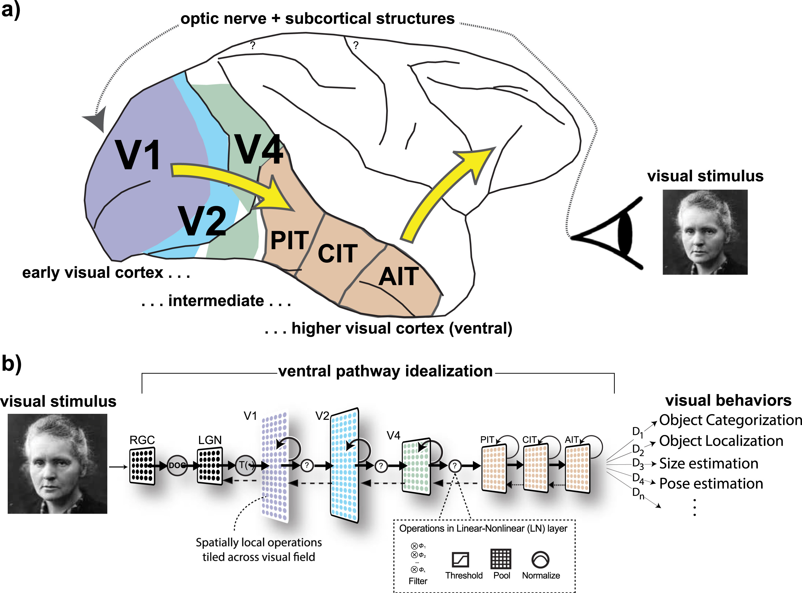
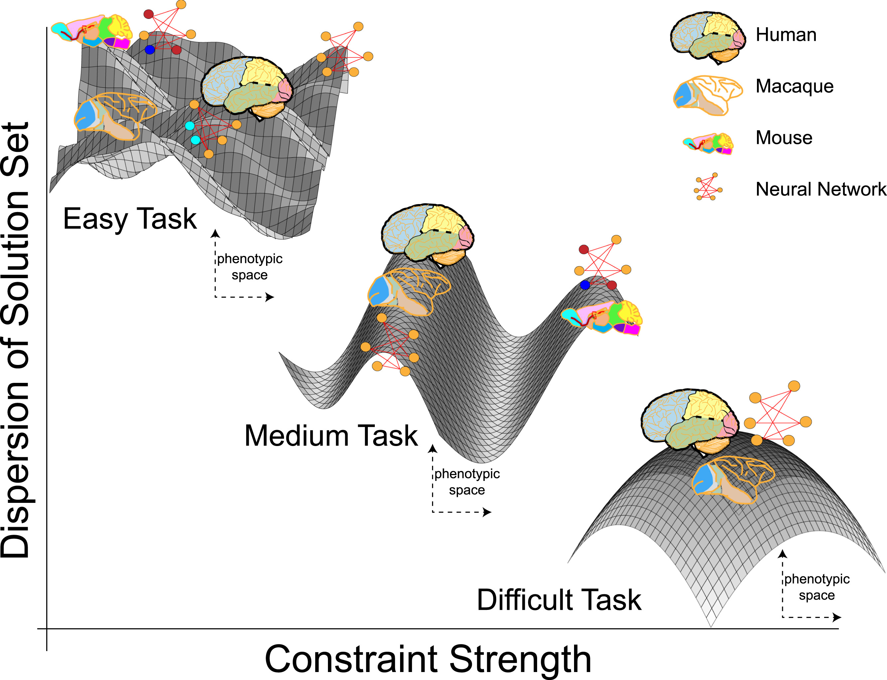

# The Normative Turn: Bridging the Gap Between AI and Brain via Top-Down Intelligibility

[Link 1: Taking mechanistic abstraction seriously.](https://doi.org/10.1016/j.cogsys.2024.101244)  
[Link 2: Functional intelligibility and the contravariance principle.](https://doi.org/10.1016/j.cogsys.2023.101200)

"Nothing in biology makes sense except in light of evolution." - Theodosius Dobzhansky (1973)

"Nothing in neurobiology makes sense except in light of behavior." - Gordon Shepherd (2015)

"Nothing in computational neuroscience makes sense except in light of optimization." - Cao & Yamins (2024)

## Part 1: The Mechanistic Argument (3M vs. 3M++)

### The Core Problem

1. **Context:** Deep Neural Networks (DNNs) are successful at predicting neural data but are criticized for lacking biological realism (e.g., no spiking, no ion channels, backpropagation is biologically implausible).
2. **The Critique：** Critics argue DNNs are merely predictive tools (instrumentalism) rather than explanatory models (realism) because they do not map to the biological mechanism.

### The Original 3M Criterion (The Old Standard)

> 3M: The parts, organization and activities of the model map to the parts, organization, and activities of the target

1. **Definition:** Model-Mechanism-Mapping (3M) (Kaplan & Craver, 2011).
2. **Requirement:** For a model to be explanatory, its variables (components, activities, organization) must corresponding directly to the components, activities, and organizatioin of the target mechanism in the brain.
3. **Limitation:** This standard is too strict. It requires a level of detail that would disqualify not only DNNs but also most canonical models in neuroscience (which rely on abstractions like "firing rate" or "receptive field").

### The 3M++ Criterion (The New Proposal)

> 3M++: The parts, organization, and activities of the model at a suitable level of abstraction picked out by PARA correspond to the parts, organization, and activities of the target via a similarity transform.

The authors propose 3M++ to legitimate meaningful abstraction. A model qualifies as mechanistic if it satisfies two conditions:

1. **PARA: Predictively Adequate Runnable Abstraction**
   - **Abstraction:** We must define a specific level of description (e.g., population firing rates) and discard lower-level details (e.g. molecular dynamics) that are not functionally revelant to the task.
   - **Runnable:** The model must be a computational implementation that can be executed to produce the behavior (ensuring casual completeness), not just a static diagram.
   - **Predictively Adequate:** The model must accurately predict the target system's internal activity and output behavior on novel inputs (generalization).
2. **Transform similarity (The mapping standard)**
   - **The Problem:** How do we judge if a model's compnents "correspond" to he brain's?
   - **The Solution:** Use **Inter-Animal Variability** as the benchmark.
   - **Logic:** Since individual brains of the same species differ, we consider them "the same system" if they can be mapped to each other via a specific transformation (e.g., a Linear Transform).
   - **Application:** If a DNN layer can be mapped to neural data using the same class of transform (e.g., linear) used to map one animal to another, the model satisfies the mapping criterion.

## Part 2: Functional Intelligibility & Optimization

### Redefining "Intelligibility"

1. **The Ontic and Epistemic Debate:**
   - Ontic View: Explanation is just the objective facts/mechanism in the world.
   - Epistemic View: Exlanation is a cognitive activity for human understanding.
2. **Authors' Stance:** They focus on intelligibility - making the dependencies between a system's form and its function cognitively accessible.
3. **Shift in Perspective:**
   - Bottom-Up Intelligibility (Old): Understanding via simple mathematical equations (e.g., Gabor filters). DNNs fail this (High cognitive cost).
   - Top-Down Intelligibility (New): Understanding via **Normative Principles**. We understand a system by knowing **what it is optimized for** (Goal) and **what limits it** (Constraints).

### The Tripartite Optimization Framework

To explain why the brain has a specific structure, the authors propose a direct analogy between Evolution and AI Training:

| Component | Artificial Neural Network (AI) | Biological System (Brain) |
| --- | --- | --- |
| Objective Function | Loss Function (e.g., Classification error) | Evolutionary Niche / Fitness (e.g., Survival, Navigation) |
| Architecture | Model Architecture (e.g., CNN, Transformer) | Biophysical/Genetic Constraints (The Body & Brain) |
| Learning Rule | Optimization Algorithm (e.g., SGD) | Evolution & Development |

**Implication:** This framework allows "methodological adaptationism." By optimizing a model with a brain-like architecture on a bio-plausible task, we can test evolutionary hypotheses about why neural structures emerge.

## Part 3: The Contravariance Principle

### The Principle Defined

There is a Contravariant (Inverse) Relationship between Task Difficulty and Solution Dispersion.

> Dispersion: The variety of different architectures/parameters that can solve a task.

### The Logic of the Landscape

1. Easy Task (Weak Constraint): The "fitness landscape" is flat. Many different solutions exist.
   - Outcome: A model trained on this task might look nothing like the brain. (High Dispersion).
2. Hard Task (Strong Constraint): The landscape is a steep funnel or a "single peak." Very few solutions exist.
   - Outcome: Any system (biological or artificial) that solves this task must converge to the same functional structure. (Low Dispersion).

### Methodological Prescription

1. **Guideline:** To build models that map to the brain, researchers should choose tasks that are as challenging as possible (matching the difficulty of the organism's ecological niche).
2. **Convergence:** Strong constraints force Convergent Evolution between the AI and the Brain.

## Part 4: Validation and Key Concepts

### The "No-Miracles" Argument (Prediction as Evidence)

1. **Giere's "Constructive Realism":** Predicting complex data (like neural responses to novel images) is a Difficult Prediction Problem. The probability of success by chance is infinitesimally low.
2. **Conclusion:** High predictive accuracy of DNNs is not just curve-fitting. It provides strong evidence that the model shares deep structural similarities with the brain, driven by shared functional constraints.

### Proxy Tasks

1. **Definition:** Since we cannot fully replicate evolution, we use "Proxy Tasks" (e.g., ImageNet classification) that approximate real evolutionary goals (e.g., object recognition for survival).
2. **Criterion:** A good proxy task must be hard enough (Contravariance) and **share underlying demands** with the ethological goal.
3. **Caveat:** If a model overfits a proxy task (e.g., becoming too good at ImageNet) and neural predictivity drops, the proxy has diverged from the true biological constraint.

> Reason for Caveat: A proxy task is merely an approximation of the actual evolutionary goal. Over-optimizing for the idiosyncrasies of the proxy task causes the model to diverge from the authentic biological constraints imposed by nature.

### Teleology (目的论) vs. Etiology (病因学)

1. Teleological (Normative) Explanation: Explains features that are useful/optimized (e.g., V1 edge detection). The Optimization Framework works here.
2. Etiological (Historical) Explanation: Explains features that are useless remnants of history (e.g., path-dependence, "spandrels"). The Optimization Framework cannot explain these; they are accidents of history, not solutions to a problem.

> **Historical Contingency (Path-Dependence)**  
> Represents the situation where multiple distinct solutions to a task are possible (the task is not strictly constraining), but **only one specific solution is actually observed in nature**. This outcome occurs not because it is the only way to solve the problem, but due to historical accidents or ancestry that locked the lineage into a specific path.
